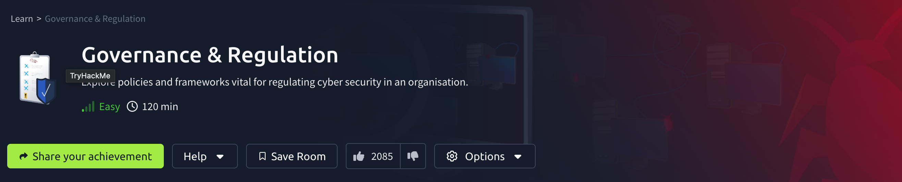
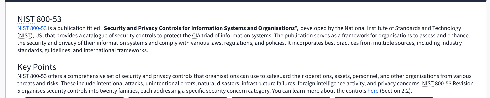
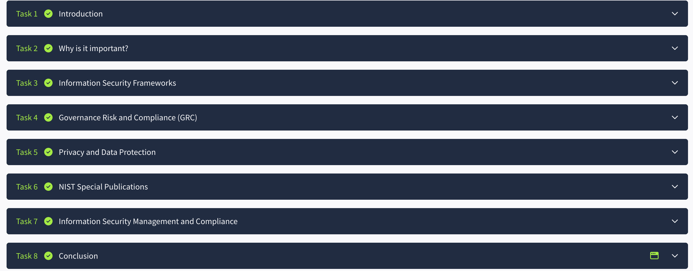
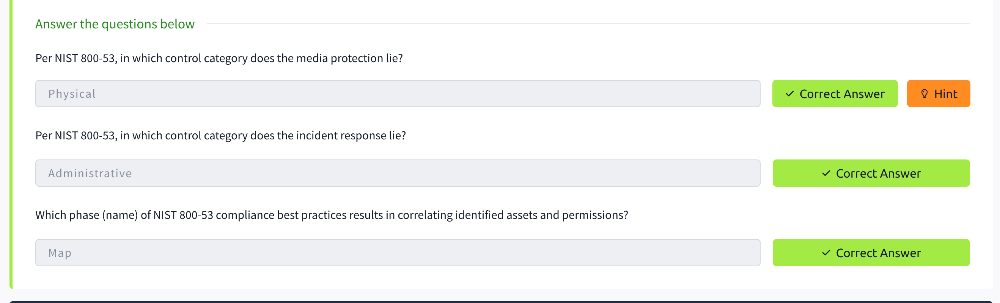

# TryHackMe---Governance-Compliance-
# 🛡️ TryHackMe - Governance and Regulation

)

## 📍 Room: [Governance and Regulation](https://tryhackme.com/room/governanceregulation)  
**Completed by:** Viann Klaus  
**Focus Area:** GRC (Governance, Risk, and Compliance) | Cybersecurity Policy | Risk Management

---

## 📘 Overview

This room explores core concepts of Governance, Risk, and Compliance (GRC) in cybersecurity. It provides insight into how organizations align security with business strategy, manage risk, and comply with frameworks like **NIST**, **ISO 27001**, and **HIPAA**.

The hands-on content supports a foundational understanding of how **security governance, policy creation, and regulatory frameworks** apply across industries—including healthcare.

---

## 🎯 Learning Objectives

- Understand the distinction between **governance**, **risk**, and **compliance**
- Explore industry frameworks: **NIST CSF**, **NIST 800-53**, **ISO/IEC 27001**, **PCI DSS**, **HIPAA**, and **GDPR**
- Learn about the role of **policies, standards, procedures, and guidelines**
- Analyze risk through practical case-based examples
- Understand how compliance controls support audits and security posture

---

## 🧠 Key Concepts Covered

| Topic | Summary |
|-------|---------|
| **Governance** | Aligning security initiatives with organizational strategy |
| **Risk Management** | Identifying, analyzing, and mitigating cybersecurity risks |
| **Compliance** | Meeting regulatory, contractual, and legal obligations |
| **Security Documentation** | Differentiating between policies, standards, and procedures |
| **Regulatory Frameworks** | Deep dive into NIST, ISO, HIPAA, PCI DSS, GDPR, etc. |

---

## 🛠️ Skills Practiced

- Mapping controls to regulatory requirements
- Reviewing example policy and audit frameworks
- Understanding the hierarchy of security documentation
- Applying NIST-based reasoning to privacy and healthcare contexts
- Translating compliance requirements into technical or procedural safeguards

---

## 🏥 Healthcare Relevance

As a former CT Team Leader in a HIPAA-regulated environment, this room reinforced how frameworks like **NIST CSF** and **NIST 800-53** are used in practice to support:
- HIPAA compliance
- Security policy enforcement
- Internal audit preparation
- Incident response and documentation

This directly aligns with my goal of transitioning into **GRC and Compliance Analyst roles** within healthcare or broader enterprise settings.

---

## 📸 Screenshots

| Section | Screenshot |
|--------|------------|
| Room Overview |  |
| Framework Comparison |  |
| Completed Tasks |   |
| Quiz Completion |  |
| Final Task Completed |  |

---

## ✅ Completion Badge

---

## 🧩 Next Steps

- Complete more GRC-focused rooms such as:
  - [Risk Management](https://tryhackme.com/room/seriskmanagement)
  - [SOC Level 1](https://tryhackme.com/path/outline/soclevel1)
- Continue building practical knowledge in policy writing, risk assessments, and compliance mapping

---

## 🔗 Connect

- 💼 [LinkedIn](https://www.linkedin.com/in/viann-klaus)
- 💻 [GitHub](https://github.com/YOUR-GITHUB)
